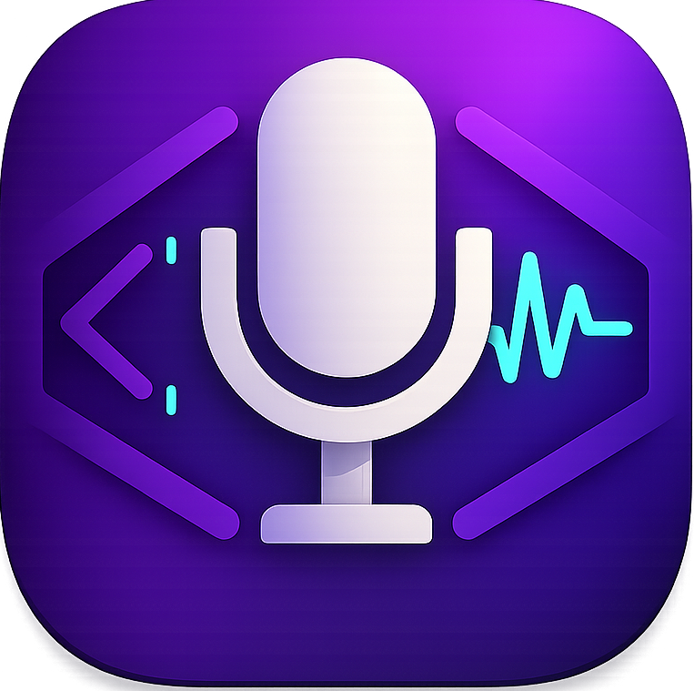
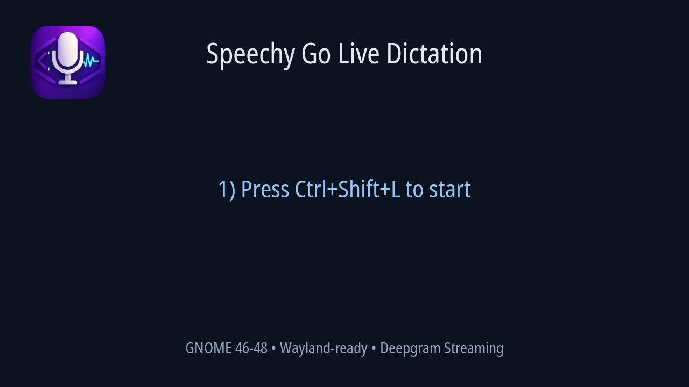
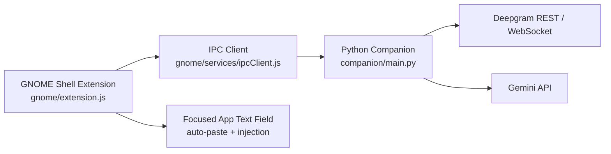

<div align="center">
  

  # Speechy Go
  ### Real-time speech-to-text for GNOME Shell (Wayland-ready)

  <p>
    <a href="https://github.com/simoabid/SpeechyGo-Gnome/blob/main/LICENSE"></a>
    
    
    
    
    
    
  </p>

  <p>
    <a href="https://github.com/simoabid/SpeechyGo-Gnome/releases"></a>
    <a href="https://github.com/simoabid/SpeechyGo-Gnome/releases"></a>
    <a href="https://github.com/simoabid/SpeechyGo-Gnome/releases"></a>
    <a href="https://github.com/simoabid/SpeechyGo-Gnome/issues"></a>
  </p>
</div>

Speechy Go is a GNOME Shell extension that captures speech, transcribes with Deepgram, optionally enhances with Gemini, and inserts text directly into the active app.

## Animated Demo

<div align="center">
  
</div>

## Why Speechy Go

- Real-time live dictation with interim and final transcript updates.
- Standard start/stop recording workflow for focused transcription.
- Wayland-friendly auto-paste strategy for active text fields.
- Built-in clipboard text enhancer powered by Gemini.
- Keyboard-first usage with global shortcuts.

## Feature Set

### Core
- Speech-to-text transcription using Deepgram.
- Optional Gemini post-processing for speech output.
- Clipboard text enhancement action.
- GNOME panel indicator with state-aware actions.

### Live Dictation
- Persistent Deepgram WebSocket connection.
- Audio chunk streaming from `parecord`/`arecord`.
- Interim transcript replacement and final commit behavior.
- Start/stop control via menu and shortcut.

### GNOME UX
- Preferences UI (Adwaita) for API keys and behavior.
- Configurable shortcuts:
  - `Ctrl+Shift+H` standard recording toggle
  - `Ctrl+Shift+L` live dictation toggle
- Health check action for backend diagnostics.

## Feature Comparison

| Capability | Standard Recording | Live Dictation (Streaming) | Clipboard Enhancer |
| --- | --- | --- | --- |
| Primary goal | Record then transcribe | Real-time dictation while speaking | Improve existing text |
| Deepgram integration | REST transcription after stop | WebSocket streaming with interim/final events | Not used |
| Gemini support | Optional post-processing | Optional after final segments | Core feature |
| Output mode | Insert + clipboard | Direct active-field injection + clipboard | Enhanced text result + copy/insert |
| Typical trigger | `Ctrl+Shift+H` | `Ctrl+Shift+L` | Menu action |
| Best use case | Focused short recordings | Continuous dictation workflow | Editing and rewriting text |

## Architecture



## Requirements

- GNOME Shell `46`, `47`, or `48`
- Python `3.10+`
- Audio backend:
  - `parecord` (preferred for streaming), or
  - `arecord`
- For live dictation: Python `websockets` package installed in the same Python environment GNOME uses

Recommended install command:

```bash
/usr/bin/python3 -m pip install --user --break-system-packages websockets
```

## Quick Start

```bash
# 1) Clone
git clone https://github.com/simoabid/SpeechyGo-Gnome.git
cd SpeechyGo-Gnome

# 2) Install node deps (scripts runner)
npm install

# 3) Install streaming dependency for GNOME's Python
/usr/bin/python3 -m pip install --user --break-system-packages websockets

# 4) Build + install extension locally
npm run gnome:install

# 5) Reload extension
gnome-extensions disable speechygo@seemoo.dev || true
gnome-extensions enable speechygo@seemoo.dev
```

## Usage

1. Open Extensions app and enable **Speechy Go**.
2. Open **Preferences** from the extension menu.
3. Add:
   - Deepgram API key (required)
   - Gemini API key (optional)
4. Trigger:
   - Standard recording via menu or `Ctrl+Shift+H`
   - Live dictation via menu or `Ctrl+Shift+L`

## Configuration Highlights

Configured through `org.speechygo` schema and preferences UI:

- API keys and Gemini behavior
- Recording backend selection (`auto`, `gstreamer`, `parecord`, `arecord`)
- Auto-paste toggle and delay
- Live streaming model/chunk size/interim toggle
- Shortcut bindings
- Notification mode and debug logging

## Developer Commands

```bash
npm run gnome:build            # Build staged extension + zip
npm run gnome:install          # Build + install to ~/.local/share/gnome-shell/extensions/
npm run gnome:health           # Companion runtime diagnostics
npm run gnome:companion-stdio  # JSON IPC stdio mode
npm run gnome:stream           # Manual stream mode (expects config JSON)
```

## Project Structure

```text
gnome/          # GNOME extension code (UI, prefs, schema, IPC client)
companion/      # Python backend (recording, Deepgram, Gemini, streaming)
scripts/        # Build/install automation
docs/           # Protocol and architecture notes
icon.png        # Extension icon
```

## Troubleshooting

### `Python package 'websockets' is required for live streaming mode`
Install with the exact interpreter GNOME uses:

```bash
/usr/bin/python3 -m pip install --user --break-system-packages websockets
npm run gnome:health
```

`gnome:health` should report a version in `streaming_websockets`, not `missing`.

### Extension shows as not found after install

```bash
gnome-extensions list --user | rg speechygo@seemoo.dev || true
gnome-extensions enable speechygo@seemoo.dev
```

If first install is not discovered immediately, log out and back in.

### Microphone stuck after abnormal stop

```bash
pkill -INT -f "companion/main.py --stream" || true
pkill -KILL -f "arecord -q -f S16_LE -r 16000 -c 1 -t raw" || true
pkill -KILL -f "parecord --raw --format=s16le --rate=16000 --channels=1" || true
```

## Security Notes

- API keys are stored in GNOME settings (`org.speechygo`).
- Companion diagnostics avoid logging secrets.
- Files are installed with safe permissions during local install.

## Current Limitations

- History UI is currently a placeholder.
- Notification filtering modes are present but not fully enforced.

## Contributors

### Maintainer
- [@simoabid](https://github.com/simoabid) — Project creator and maintainer

### Contribution Workflow
1. Fork the repository.
2. Create a feature branch (`feature/your-change`).
3. Commit with clear messages.
4. Open a pull request with testing notes and screenshots/logs when relevant.

### Community
[](https://github.com/simoabid/SpeechyGo-Gnome/graphs/contributors)

## License

MIT — see `LICENSE`.
